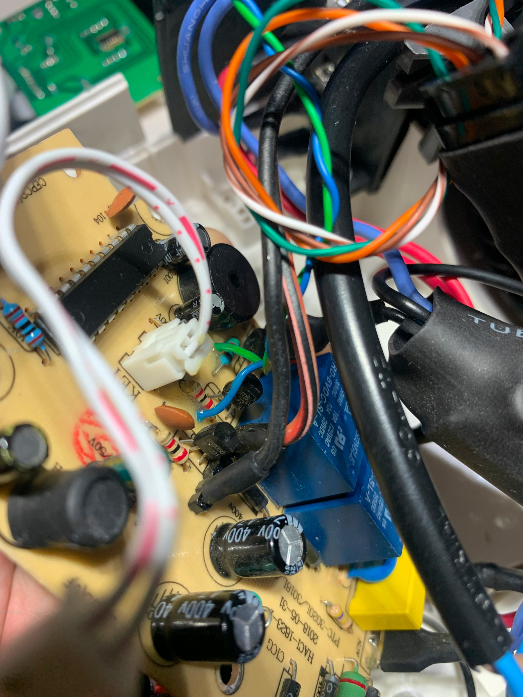
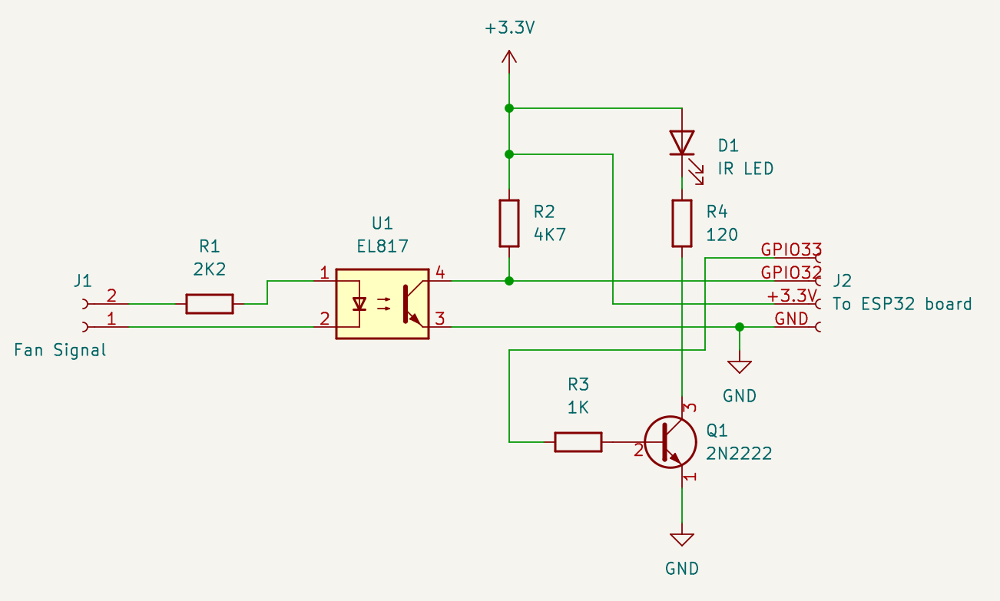

# Clustered Heating Controller

## Overview

The motivation for this project was to be able to use electric heaters to control the temperature in multiple
rooms in the same house, while at the same time ensuring the fair use of the available electric power among these.

The support for the Berry language which is included in the Tasmota 32 releases, is an exceptional capability
allowing users to code complex logic and even device drivers as instructions that are compiled in runtime by 
the interpreter.

Given the low cost of ESP32 devices, Tasmota and Berry became a very compelling platform to leverage the potential of
this type of hardware. In practice, not just allow for the creation of simple rules and configurations like we were used
to with previous projects, but also provide an imperative language with objects and closures, and all of this
available on the edge, without the need to compile and reflash devices in order to add new behaviour or features.

I decided to incorporate a dev board of this type (LC Technology AC90V-250V 1 Relay ESP32 board) into a set 
of Delba electric heaters:

https://templates.blakadder.com/ESP32_Relay_AC_X1.html


These are pretty conventional ceramic heater devices, which feature the PTCheater elements, an electronic 
thermostat board, a fan and an IR remote control.


Because the controller I needed to create was too sophisticated to be implemented via Tasmota
rules, and on the other hand a bit too domain specific to be coded as an integral part of the Tasmota
firmware, I considered that using Berry could be a good idea. And so it was and I don't regret the choice. 

This Berry script should easily be adapted to other types of devices with similar characteristics,
with this or similar ESP32 based boards, as long as it has at least 4 available GPIOS available (see below - 
one being and analog input). A relay is also a relevant feature, especially if power or isolated control
of the heater is required.

Together with the ESP32 relay board, I have added a DS18B20 temperature sensor for measuring the air 
temperature, a analog Current Transformer sensor to monitor the current consumed by each heater, 
an IR LED for sending commands to the heater (emulating the IR remote control), and an optocoupler to 
pickup the signal of the fan when is on (this way obtaining feedback on the user having turned on the heater).

In this adaptation process I looked forward to be the least invasive as possible to the original
hardware in order not to have any interference with the safety aspects of the original design, and
also not to bring additional failure modes. As such I kept the ESP32 totally isolated from the heater own
electronics and the communication with its control board is only done via IR signals, and via the optocoupler.


To control power, the relay on the ESP32 board is used to actuate the original relays from the heater,
by being connected in series with the coil and the transistors that drive these coils (which are 
part of the original heater control board). As such the ESP32 board is unable to independently 
turn on the heater elements, requiring the heater control board to also turn on the relays in order
to close the circuit. Even though the heater also has a thermal fuse and a thermal circuit breaker,
I preferred not to take chances and keep the original power control path untouched.

This ESP32 board also has the advantage of having its own SMPS 230 Volt isolated power supply. 


This is an advantage if electrical interface with other devices would be required, as the heater control board 
IS NOT an isolated circuit. To produce the 5 VDC required for operation, it uses a uninsolated DC converter 
chip which converts the mains voltage directly to low voltage DC without galvanic isolation. This is very 
common in these types of home appliances.

## Features

This Berry script provides the following features:

 * Loop control of how many heaters remain turned on, based on metering data and power budget provided via MQTT to these;
 * Ability to cycle between heaters when running with power constraints;
 * Ability to remote control the heaters and their features exposed via IR interface (temperature setting, power, timer, etc);
 * Interprets AC current sensor feedback for adjust loop control and doze mode;
 * Heater on/off status feedback;
 * Driver for exposing control loop parameters and status;


## Operation

### Control loop

The script expects a message to be periodically (ideally below PWR_RPRT_TIMEOUT seconds) sent to the topic:

```
tele/heaters/PowerReport
```

This message must provide the realtime measurement on the active power consumption. This can usually be obtained from 
a MODBUS capable electricity meter or from an equivalent kind of energy meter installed in the house. 
It is important that the reported values reflect the consumption of the entire circuit (e.g. house) where the
loads are connected to.

The message has the following structure:

```
{ 
  "CurrentPower": integer,
  "RemainingPower": integer
}
```

Where `CurrentPower` corresponds to the active power currently being consumed, and `RemainingPower` is 
the amount of power margin still available before the circuit breaker cuts the power (you may for example define it 
as the difference between the contracted power and the active power).

Based on this information, we have the "error signal" that causes the control loop to take action and 
force one or more of the nodes (heaters) to change state.

The state machine is described by the diagram below:


Besides being idle or heating, when the heater is first turned on, it first goes through the "Grace Heat"
intermediate state, where it is given the chance to turn on the heating element for a while, even if the 
power budget is overrun during that period. This period can be adjusted through the GRACE_HEAT_PERIOD variable.
Nevertheless if there are more heaters from the cluster running, one of these will turn itself off to keep
the power demand below the limit. The reason for this "Grace Heat" state is so that the user can get the 
perception the heater is running normally and producing heat once it is turned on.

Between the heater announcing that wants to produce heat, and actually committing to turning on the heating
element and change to the "Heating" state, it stays in the "Request Heat" state. During this state it
evaluates if there is another heater committing to the "Heating" state, announcing and proceeding to the 
"Heating" state if that is not the case.

Inversely, while the heater is in the "Heating" state and when the power demand increases and rises above the 
limit reported in the PowerReport messages, it announces that it wants to cool down, switching to the 
"Request Chill" state. If no other heater is committing to cool down (turn off its heater element), then
this heater changes to the "Request Heat" state, announces that change, and turns off its heater element. 
And with this, the cycle repeats until deactivate_heater() is triggered. The latter can be called 
due to a user action (pressing the ON/OFF button on the remote, via the StopHeat MQTT command, or due
to the doze mode being triggered for that heater - which will happen in a round robin fashion for each heater).

### Commands

This script exposes two Tasmota commands:

**StartHeat** - this command instructs the heater to start running. The parameters and modes defined 
via this command map to the Delba heater built in features that are normally called via IR commands.

It takes the following payload:

```
{ 
  "HeatMode": integer,
  "TargetTemperature": integer,
  "Duration": integer,
  "HeatLevel": integer
}
```

`HeatMode` is the only mandatory parameter, and it specifies if the heater will be running in thermostat mode
or power mode. All other parameters are optional and context dependent. 

As such, if we want to run the heater in **thermostat mode**  we need to pass the following payload:

```
{
  "HeatMode": 0,
  "TargetTemperature": 23
}
```

Where `TargetTemperature` is the target temperature in degrees Celsius.

We can also optionally limit the heating duration to 2 hours by passing the argument:

```
{
  "HeatMode": 0,
  "TargetTemperature": 23,
  "Duration": 2
}
```

but if we want to run the heater in **power mode**, we need to provide the following arguments:

```
{
  "HeatMode": 1,
  "HeatLevel": 1
}
```

Where `HeatLevel` has the following 3 possible values:

 * 0 - no heating, only the fan recirculating air;
 * 1 - half power setting (approx. 1000 Watts)
 * 2 - full power setting (approx. 2000 Watts)

<br>

**StopHeat** - commands the heater to stop. This command takes no arguments.

## Data Model

### Power Usage messages

The heater cluster relies on the exchange of some messages types via MQTT in order to achieve the coordinated operation
it is designed for.

#### Power consumption report

First there is the above mentioned power report message which is provided by an external system (e.g. Home Assistant).

```
{
  "CurrentPower": integer,
  "RemainingPower": integer
}
```

#### HeatRequest message

During the operation of each heater, whenever a heater intends to turn its heating element on, it
sends a HeatRequest message to the cmnd/heaters/HeatRequest topic:

```
{
  "HeatReqTime": integer,
  "HeatReqId": "FF:FF:FF:FF:FF:FF",
  "HeatReqState": 0
}
```

This is a preparation message ("HeatReqState": 0 means reservation), and other heaters which haven't yet sent a similar 
request, will give up and try later.

A while after this message is sent, there is another similar message which is called a commit message:

```
{
  "HeatReqTime": integer,
  "HeatReqId": "FF:FF:FF:FF:FF:FF",
  "HeatReqState": 1
}
```

When the device sends this message it means there is no turning back, and it just announcing that will turn its heater
on. Before this message is sent, the device first checks if there was no other device doing the same in 
the short term. If yes, it gives up and waits for the next opportunity.

#### ChillRequest message

Similarly to the HeatRequest messages, there is also a ChillRequest that is sent to the cmnd/heaters/ChillRequest

```
{
  "ChillReqTime": integer,
  "ChillReqId": "FF:FF:FF:FF:FF:FF",
  "ChillReqState": 0
}
```

This is the opposite of the HeatRequest message, as it requests the intention to turn off the heater element. The reason
for this type of request is because as the power budget becomes insufficient for all heaters, we want to disable 
the minimum number of heaters while still staying below the limits. With this approach we avoid that all devices 
react to the insufficient power condition at the same time and turn their heat off simultaneously.

Here there is also a commit message, once the device is set to turn its heater off:

```
{
  "ChillReqTime": integer,
  "ChillReqId": "FF:FF:FF:FF:FF:FF",
  "ChillReqState": 1
}
```

#### StateReport message

When multiple heaters are running at the margin of the available power, without any additional measure, 
these would reach a steady state where the same set of heaters would stay on, while one ore more
of the heaters would stay off until the power budget would change. This means that these heaters
would get into starvation and not being given the opportunity to heat the room.

In order to prevent this, each device provides a special status message that is published to cmnd/heaters/StateReport.

This message looks like the following:

```
{
  "Time": integer,
  "Mac": "FF:FF:FF:FF:FF:FF",
  "State": integer
}
```

As every device reads this message, each one is able to build and keep up to date a table containing 
the status of each device. With this information a order number is computed based on the MAC address of each device. 
This order number allows each device to be assigned a unique timeslot for a given time frame (e.g. 60 minutes).

With this timeslot, each device knows that when its time arrived and consumption is at the margin, it
must turn itself off to give opportunity to another device. This way we even out the overall time that 
each heater is running, ensuring even heating across all rooms.

## Installation

1. Create or edit the autoexec.be file with the following line:

```
load('heater_control.be')
```

2. Upload the heater_control.be script to the Tasmota device.

## Configuration

### Tasmota

In Tasmota you need to make sure that the IO ports are correctly configured for the peripherals
used by this script. You can use this template to establish that assignment:

```
{"NAME":"clustered-heater","GPIO":[0,0,0,0,0,0,0,0,0,0,0,0,224,0,0,0,0,0,0,544,0,0,0,1312,0,0,0,0,160,1056,4896,0,0,0,0,0],"FLAG":0,"BASE":1}
```

This corresponds to the following PIN assignments:

```
IO GPIO27;DS18x20;1
AO GPIO32;Switch;1
AO GPIO33;IRsend;1
IA GPIO34;ADC CT Power;1
```


Next you need to make sure that each heater is set for the heaters shared topic.

```
GroupTopic2 heaters
```

### Variables

The constants declared in uppercase can be relevant to be adjusted by the user. Below is an explanation of each:

|Variable             |Sample value          |Description                                                                                                    |
|:--------------------|:---------------------|:--------------------------------------------------------------------------------------------------------------|
|DEFAULT_TEMP         |18                    |Default temperature if none is specified and HeatMode = 0                                                      |
|PWR_RPRT_TIMEOUT     |10                    |Maximum time in seconds to consider a power report value as valid                                              |
|REQUEST_PERIOD       |4                     |Time (in seconds) between consecutive Heat or Chill requests                                                   |
|SENSOR_PERIOD        |2                     |Time (in seconds) between consecutive CT current sensor readings to populate variables                         |
|GRACE_HEAT_PERIOD    |10000                 |Duration of the grace heat period in seconds.                                                                  |
|STATE_PUB_PERIOD     |5                     |Time between StateReport messages in seconds.                                                                  |
|DOZE_DEAD_BAND       |1000                  |Time spacing in milliseconds between finishing a doze period and the next cron schedule                        |
|DOZE_CYCLE           |60000                 |Duration of the doze cycle which is then split by the number of heaters (milliseconds).                        |
|HEATER_MAX_POWER     |1000                  |Assumed heater max power (in Watts).                                                                           |
|MIN_RELEVANT_POWER   |100                   |Minimum measured power to consider a valid reading of when the heater is on.                                   | 
|HEATER_LEVEL         |1                     |Default heater level (0 = no heat; 1 = minimum; 2 = maximum)                                                   |
|STATE_MAX_AGE        |15                    |Maximum time a StateReport entry will be kept in the corresponding table by each device, if there is no update.|

### Energy consumption message

For example if you have Home Assistant with an integration to a metering device already in place, you can easily configure
an automation to report the power to the heaters:

```
- id: power_report
  alias: power_report
  trigger:
    platform: time_pattern
    seconds: "/5"
  action:
    - service: mqtt.publish
      data:
        topic: "tele/heaters/PowerReport"
        payload: '{{ { "CurrentPower": states("sensor.mains_active_power") | int, "RemainingPower": 6900 - (states("sensor.mains_active_power") | int) } | tojson }}'
```

The  above automation will publish the power consumption message to the heaters every 5 seconds. The 6900 Watts represents 
the maximum power of the circuit breaker, and can be replaced with the most appropriate for the user scenario.


## Telemetry

Tasmota publishes a telemetry message with the current status of sensors, switches and other devices at regular intervals. This
interval is configured via the TelePeriod <xx> command, where xx is the number of seconds between telemetry reports.

This code declares a driver which adds the information from the heating controller to this telemetry message.

The message is published to a topic named as:

```
tele/<heater name>/SENSOR
```

and the message is something similar to:

```
{
    "Time": "2024-02-14T23:06:09",
    "Switch1": "OFF",
    "ANALOG": {
        "CTEnergy1": {
            "Energy": 0.559,
            "Power": 9,
            "Voltage": 230,
            "Current": 0.038
        }
    },
    "DS18B20": {
        "Id": "0000003CD458",
        "Temperature": 21.8
    },
    "HeatingController": {
        "TargetTemperature": 27,
        "Duration": 7,
        "HeatMode": 1,
        "HeatLevel": 2
    },
    "TempUnit": "C"
}
```

Of course that the amount of information and values will vary according to what sensors and other peripherals are configured
in the user device.

In what concerns this script, it exposes the mode the heater is currently set (HeatMode), the power level (HeatLevel), 
the duration in hours that is configured for (or -1 if it was not set), and the target temperature the thermostat is set to 
(TargetTemperature).

Note: because in this design the ESP32 is unable to obtain the current thermostat settings and other parameters 
from the heater microcontroller itself, this means that if the user changes a setting via the IR remote control, the
information presented in the telemetry about the HeatingController will not be in sync anymore. The only status obtained 
directly from the heater is that of the fan via the optocoupler.

## Hardware

### Extra components

As you may have guessed by the GPIO pin assignment, besides the "ESP32_Relay_AC_X1" board there are a few more hardware 
requirements assumed by this setup. The ones I am considering are the following:

 * DS18B20 temperature sensor - provides an independent and accurate reading of the ambient temperature that can 
 be used to monitor the heater, or for implementing a separate thermostat;
 * Optoisolator such as the EL817 - the electronics in the heater are at mains potential. We are using this component
 to obtain the fan signal provided by the onboard microcontroller, while keeping the ESP32 isolated from the mains
 potential.
 * IR emitter for sending control signals to the heater (therefore emulating the IR remote control)

### Integration with the heater

#### Heater control

For this integration, safety was the first thing to consider. As such, in order to be the least invasive as possible to the original design (avoiding new failure modes
that could put the safety of the device at risk), the following considerations were taken:

 * do not allow power to the heating elements to be overriden by our board or any of the additional circuitry, i.e. our
 circuit may cut the power to the heater, but not turn it on in such way that bypasses the onboard microcontroller
 decision. Only provide subtractive control, but not additive control.
 * do not bypass or remove any of the thermal protections built into the heater - the latter features a thermal fuse 
 and a thermal control thermostat;
 * the ESP32 does not switch the power to the heater elements (in spite of having a mains rated relay), but instead
 it switches the DC power to the transistors that drive the original onboard relays.

 For this effect you can see below a diagram representing the portion of the Delba heater PCB which controls the power to the fan and the ceramic elements.

 The blue dotted boxes represent the modifications and what portions of the circuit these tap into.

 

 I have modified two similar models of the Delba PTC heaters: the Delba DB-614, which is a slightly more "premium" model of the product line:

 

 and the DB-821:

  

 Both are very similar, where the only real difference in the first one is a motorized flap to allow the airflow to be directed.
 
 While the exact layout of the changes were different for each model (because each has a slighly different PCB), I will focus on the modification to the DB-821 as both are equally valid for explaining the concept around these modifications. 

 The first modification is the tap between R1 and pin 19 of the U1 microcontroller. This is used for the ESP32 to know if the fan is ON or OFF (which in turn gives an indication if the user turned the heater on via the remote). More details about the custom board where J2 connects can be found later in this document.

 The second modification consists of having the VCC rail powering the RL1 and RL2 relay coils be switched by the relay that is on the ESP32 board. This provides a safe configuration, so that for the heater elements to be turned on, both the ESP32 relay and the Q1 and Q2 transistor that drive RL1 and RL2 need to be turned on. This way neither the ESP32 board nor the Delba control board are able to independently turn on the heaters.

 In the board, for the first modification (fan signal), I have drilled two small holes in order to get the wires for the signal and GND soldered through:


(the GND and Fan signal wires shown in the image)

 Regarding the 2nd modification, I have just removed the shunt wire shown in the image:
 
 
 
 And put the J3 socket in the same place. This socket then connects to the ESP32 board built-in relay.



#### Digital control and status

As mentioned above there is a custom IO board. Its purpose is twofold:

  * Provide a galvanically isolated signal that indicates the fan state to the ESP32;
  * Provide an optical IR signal for the receiver located in the front of the unit. This enables communication with the heater microcontroller via the interface as the original remote control (standard 38 KHz NEC style signals).

Below is the schematic diagram of the board:

 

It simply consists of the EL817 optocoupler for obtaining the feedback from the fan status, and it contains a standard Vishay TSAL6100 IR LED for sending remote control signals to the heater control board. In order to drive the IR LED, a 2N2222 bipolar transistor is used.

In my setup, I have separated the IR LED in a smaller board which I placed closer to the IR receiver for optimal signal coupling:

 

 There is no physical connection to the heater display board that is in the center. The 4-pin connect goes directly to the ESP32 board and it provides power (+5V) to this I/O board, as well as the fan signal and the IR output signal.

#### Sensors

Besides the fan status, I have also considered relevant to include two sources of input data:

 * a temperature sensor (one DS18x20);
 * a current transformer for sensing the heater element current;

With the first, one can monitor the ambient temperature, allowing to improve the temperature control on top of the built-in thermostat;

With the current transformer, the ESP32 can monitor the operation of the heater and determine in what state is currently in (i.e. off/half power/full power).

As the current transformer, I have used a HW-670 board. This board has a current sensing coil, an LM358, and a few passive components. It is designed to sense a maximum of 5 Amps, but with a small modification I was able to increase its range.

In practice I did three modifications to this board in order to satisfy my use case. First is to replace the R11 resistor which originally has a value of 100 Ohm, by a 22 Ohm resistor. This reduces the input signal to the amplifier, therefore increasing the range of the circuit (we need it to measure at least 10 Amps of maximum current).

The other two modifications consist of replacing the 1 uF C6 capacitor, with a generic 1N4148 diode. The same capacitor is then put between the output pin at the J1 connector, and GND. With this modification we rectify the AC waveform and have a positive DC signal suitable for the ESP32 analog input.

 

The replacement of R11 and C6:


The addition of C6 in parallel with the output:


## TODO

  * Optimize behaviour on Wifi / MQTT connectivity issues;
  * Use the DS18B20 as an independent temperature sensor for implementing custom thermostat and/or failsafe;
  * Use the CT current sensor for detecting failure conditions (e.g. relay latching / heater never turning off);
